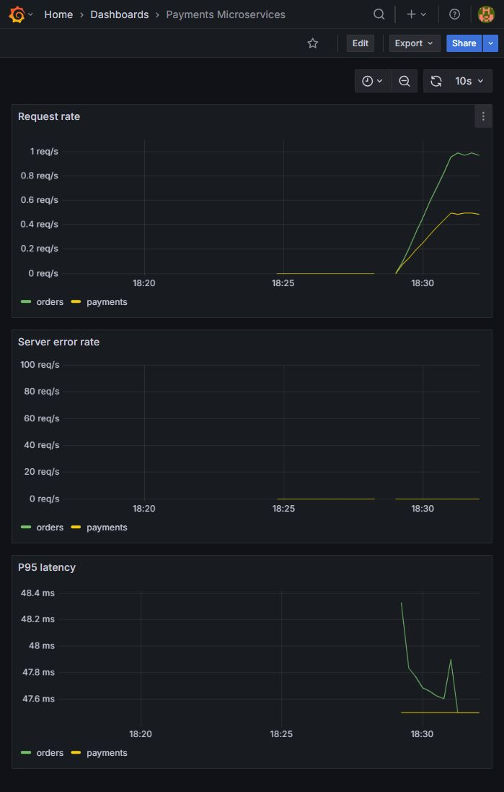
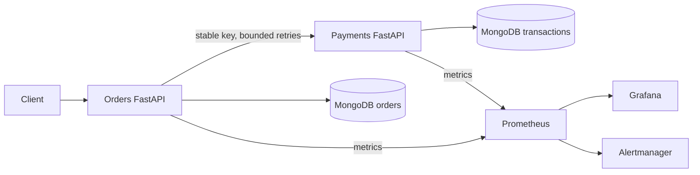

# Containerised Payments Microservices with CI/CD & Monitoring

[](https://github.com/vasun26shriya/containerised-payments-microservices/actions/workflows/ci.yml)

Runnable portfolio simulation. No real provider, card data, or actual money movement.

Public images: [Orders](https://hub.docker.com/r/shriyavsingh/payments-orders) and [Payments](https://hub.docker.com/r/shriyavsingh/payments-payments), tagged with full Git commit SHAs. See [verified deployment evidence](docs/verification.md).

## Demo and portfolio

- [Five-minute presentation and recorded API replay](docs/demo-guide.md): actual successful/declined orders, duplicate identity, conflict and restart recovery. Open `docs/demo/index.html` locally to play the saved responses.
- [Interview design guide](docs/interview-guide.md): consistency, failure handling, release tradeoffs and a defensible resume entry.
- [Independent operations practice](docs/practice-guide.md): startup, troubleshooting, recovery, backups, upgrade/rollback and precise lab cleanup.
- [Security guide](docs/security.md): separate service tokens, authenticated MongoDB, mounted secrets, verified restores and image scanning.



The separate secured demo starts with `python scripts/create_demo_secrets.py`, then `docker compose -p payments-secure -f compose.yaml -f compose.secure.yaml up --build -d --wait --wait-timeout 240`. Orders is on port 28000 and Payments on 28001. See the security guide for verification and credentials handling.



## Repository

- `services/common.py`: validated models, error envelope, JSON request logs, metrics.
- `services/orders.py`: durable pending orders, payment retries and recovery worker.
- `services/payments.py`: atomic simulated payment result and idempotency enforcement.
- `services/*.Dockerfile`, `compose.yaml`: independent API images and local stack.
- `helm/payments/`: API Deployments, Services, ConfigMaps, external Secret references, development MongoDB StatefulSet/PVC, dev/prod values.
- `monitoring/`: Prometheus rules, Alertmanager configuration, provisioned Grafana dashboard.
- `tests/`: model tests and real MongoDB integration tests.
- `scripts/smoke_stack.py`: smoke tests for deployed APIs, Prometheus and Grafana.
- `scripts/verify_grafana.py`, `scripts/verify_monitoring.py`: isolated native provisioning and alert demonstrations.
- `.github/workflows/ci.yml`: test/config gates and SHA image publication.
- `docs/runbook.md`: exact deployment, alert, release and recovery commands.

## Quick start

Prerequisites: Python 3.13, Docker Engine with Compose v2. Kubernetes demonstration also needs kubectl, Minikube and Helm 3.17+. Run commands from repository root. Commands use PowerShell; CI uses Bash.

```powershell
Copy-Item .env.example .env
python -m venv .venv
.\.venv\Scripts\Activate.ps1
python -m pip install -r requirements-dev.txt
docker compose up --build -d
Invoke-RestMethod http://localhost:8000/health/ready
$order = Invoke-RestMethod -Method Post http://localhost:8000/orders -ContentType application/json -Body '{"amount":1250,"currency":"INR","outcome":"success"}'
Invoke-RestMethod "http://localhost:8000/orders/$($order.id)"
Invoke-RestMethod -Method Post http://localhost:8001/payments -Headers @{'Idempotency-Key'='demo-1'} -ContentType application/json -Body '{"order_id":"external-demo","amount":1250,"currency":"INR","outcome":"failure"}'
```

Repeat the last request: same result and transaction ID. Change its amount: HTTP 409. `amount` is integer minor units (1250 INR = 12.50 rupees); supported codes are USD/EUR/GBP/INR. Inputs reject unknown fields. Orders are POST `/orders`, GET `/orders/{order_id}`; payments are POST `/payments`. Errors use `{"error":{"code":"...","message":"..."}}`; validation adds `details`. APIs expose `/docs`, `/health/live`, `/health/ready`, `/metrics`.

## Consistency and recovery

Orders persist the pending record and a unique payment key before making a network request. All three attempts reuse that key and identical payload; transport errors, 429 and gateway/unavailable responses trigger bounded exponential delays. A missing response is ambiguous, so the order stays pending. A background worker scans due pending orders every five seconds using a compound status/next-attempt index and continues after process restart. Unresolved orders are rescheduled so the first batch cannot starve later records. Final states are conditional updates from pending, so concurrent workers cannot overwrite a terminal state. A declined simulated payment returns 200 with status `failed`; transport failures never imply a decline.

Payments uses a unique `key` index and `$setOnInsert` atomic upsert to persist the original payload, transaction ID and final status together. Concurrent duplicate-key races read the winning record. Payload differences return 409. Response delay occurs after persistence to demonstrate a committed payment with a lost response. Separate databases reflect service ownership; no distributed transaction is used. The client may see pending until recovery converges. Creating an order twice creates two separate orders: order creation itself does not implement client idempotency.

This atomic simulation is deliberately possible because there is no external charge. A real provider requires provider idempotency, a durable processing state machine, reconciliation/webhooks and outbox delivery. MongoDB failures leave readiness unhealthy and can produce 500; this demo does not promise durability after disk loss. For production use replica sets and majority writes. Permanent payment API errors stay pending for investigation; they need operator tooling and alerts in production.

## Configuration

| Variable | Default | Purpose |
|---|---|---|
| MONGO_URI | mongodb://localhost:27017 | Connection secret, supplied separately in Kubernetes |
| MONGO_DATABASE | orders or payments | Database owned by service |
| PAYMENTS_URL | http://localhost:8001 | Orders dependency URL |
| PAYMENT_TIMEOUT_SECONDS | 2 | HTTP operation timeout; connection timeout is 1s |
| PAYMENT_ATTEMPTS | 3 | Attempts per settlement cycle |
| RECOVERY_INTERVAL_SECONDS | 5 | Poll interval |
| PAYMENT_RESPONSE_DELAY_SECONDS | 0 | Simulated delay after commit, development only |
| GRAFANA_ADMIN_PASSWORD | local-demo-change-me | Compose Grafana password |
| API_AUTH_REQUIRED | false | Fail startup unless a service token is configured |
| API_TOKEN / API_TOKEN_FILE | unset | Service-specific bearer credential; file variant supports mounted secrets |
| PAYMENTS_API_TOKEN / PAYMENTS_API_TOKEN_FILE | unset | Orders outbound Payments credential |
| MONGO_URI_FILE | unset | File-mounted connection URI; mutually exclusive with MONGO_URI |

Use the provided `.env.example` for Compose variables. Direct Python runs consume process environment variables, not `.env` automatically. Run each API in a separate terminal using `python -m uvicorn services.orders:app --port 8000` and `python -m uvicorn services.payments:app --port 8001` with MongoDB running.

## Tests and delivery

```powershell
docker compose up -d mongo
$env:TEST_MONGO_URI='mongodb://localhost:27017'
python -m pytest -q
docker compose config --quiet
helm lint helm/payments
helm template demo helm/payments -f helm/payments/values-dev.yaml
helm template demo helm/payments -f helm/payments/values-prod.yaml
```

Integration tests create isolated random databases and drop them afterward. Without `TEST_MONGO_URI`, they explicitly skip; model tests still run. CI always sets it and uses a real MongoDB container. `constraints.txt` freezes the compatible transitive dependency set. Ruff checks keep the Python source formatted and linted. Tests cover sequential/concurrent duplicates, unique index, conflicts, both outcomes, orders, timeout after commit, retries, recovery in a fresh app, dependency health and normalized metrics. ASGI tests inject transport timeouts; a real TCP integration test starts both APIs, loses a response after payment commit, restarts both processes and verifies recovery to the original transaction ID.

Configure GitHub repository Secrets `DOCKERHUB_USERNAME` and `DOCKERHUB_TOKEN` (Docker Hub access token with write permission). On PRs and pushes to main, tests and configuration checks run. Compose smoke tests verify APIs and monitoring. A pinned Minikube job verifies install, upgrade and rollback with persisted orders. A secured-stack job checks authentication, scoped database access and backup restoration. Both API images receive checksum-verified Grype scans with retained JSON reports. Publication waits for all five job groups; scan findings are reported, not currently blocked by severity. Passing main pushes publish `USERNAME/payments-orders:FULL_COMMIT_SHA` and `USERNAME/payments-payments:FULL_COMMIT_SHA`. SHA tags are immutable by convention: restrict registry write permissions; Docker Hub can otherwise overwrite tags. CI uses a disposable Minikube cluster. Local and production releases use the runbook commands.

See [deployment runbook](docs/runbook.md) for Minikube, upgrades, rollback and monitoring.

## Contributors and demonstration guides

- [Shriya (`vasun26shriya`)](https://github.com/vasun26shriya): existing implementation, deployment, monitoring, and project integration.
- [Shreya (`yasho-26singh`)](https://github.com/yasho-26singh): [hosted demo guide](docs/hosted-demo.md), including the differences between the public app and this containerised stack.
- [Sasyak (`SasyakSubudhi`)](https://github.com/SasyakSubudhi): [payment consistency reference](docs/payment-invariants.md), covering idempotency, timeout recovery, and production boundaries.

The two new guides are AI-assisted contributions published through the contributors' connected accounts. Earlier implementation commits retain their original authorship.

## Production limitations

Default development MongoDB is unauthenticated and single-node. The separate secured Compose mode implements machine-token authentication, scoped MongoDB users, mounted secret files and a tested local restore. Production Helm values enable API tokens and require per-service external database URIs and verified image tags. This is a deployment skeleton, not production certification. Add end-user identity/authorization, TLS/Ingress, network policies, coordinated secret rotation and managed secret provisioning, offsite encrypted backups, a replica set, majority write concern, rate limits, tracing, severity-based scan policy, pinned action/image digests, disruption budgets and autoscaling. Polling workers have no leases/backpressure and can scan the same records across replicas. They use an indexed next-attempt schedule to avoid starvation. Bound concurrency and add jitter, retry budgets/dead-letter queues and pending-age alerts at scale. Monitoring is local with ephemeral storage; production needs retention, HA and authenticated access. Metrics omit query strings and IDs, normalize routes and use `unmatched` for unknown paths. Readiness failures contribute to server-error alerts; business declines are HTTP 200.

## Verification status

The expanded 18-test suite passed against real MongoDB, including actual HTTP timeouts/restarts and authentication checks. Secured-stack access checks and isolated backup restoration passed locally; the recorded demo contains nine actual response steps. The baseline deployment also passed Compose, Helm, monitoring rules and live alert delivery, and published both SHA-tagged images through GitHub CI. See [verification record](docs/verification.md) for revision-specific results and new workflow status, [secure evidence](docs/secure-evidence.json), [restore evidence](docs/backup-evidence.json), and [alert evidence](docs/monitoring-evidence.json).

## Official configuration references

- [MongoDB indexes](https://www.mongodb.com/docs/languages/python/pymongo-driver/current/indexes/)
- [PyMongo async queries](https://www.mongodb.com/docs/languages/python/pymongo-driver/current/crud/query/)
- [Prometheus configuration](https://prometheus.io/docs/prometheus/latest/configuration/configuration/)
- [Prometheus alert rules](https://prometheus.io/docs/prometheus/latest/configuration/alerting_rules/)
- [Histogram quantiles](https://prometheus.io/docs/practices/histograms/)
- [Helm upgrade](https://helm.sh/docs/helm/helm_upgrade/)
- [Helm release management](https://helm.sh/docs/intro/using_helm/)
- [Minikube image builds](https://minikube.sigs.k8s.io/docs/commands/image/)
- [Grafana provisioning](https://grafana.com/docs/grafana/latest/administration/provisioning/)
- [Compose specification](https://github.com/compose-spec/compose-spec/blob/main/spec.md)

